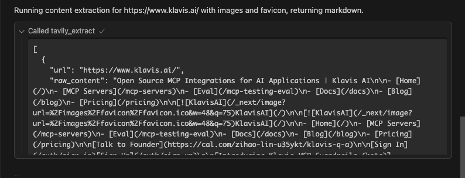

# Tavily MCP Server for Klavis AI

This MCP server integrates the Tavily AI search platform into the Klavis AI ecosystem. It provides atomic, AI-friendly tools for real-time web search and site understanding.

---

## Features

Exposes four atomic tools:

- `tavily_search` – Real-time web search with filters and optional raw content, images, and favicon
- `tavily_extract` – Extract structured text/images from one or more pages
- `tavily_crawl` – Crawl a site with depth/breadth control and optional extraction
- `tavily_map` – Map a website’s structure and discover pages

All tools include robust validation and clear error messages.

---

## Requirements

- Python 3.12+
- Tavily API key
- Ports: default `5002` (configurable)

Environment variables:

- `TAVILY_API_KEY` (required)
- `TAVILY_MCP_SERVER_PORT` (default: 5002)

---

## Get a Tavily API Key

- Create an account: `https://app.tavily.com`
- Generate an API key from your account page
- Copy the key (it looks like `tvly-...`) and set it as `TAVILY_API_KEY`
- Free tier provides monthly credits; see pricing in Tavily docs

---

## Local Setup

- 1) Clone repository and cd into the Tavily server directory

```bash
git clone https://github.com/Klavis-AI/klavis.git
cd klavis/mcp_servers/tavily
```

2) Create `.env`

```bash
cp .env.example .env
# edit .env and set TAVILY_API_KEY
```

3) Create virtual env and install deps

```bash
python3 -m venv .venv
source .venv/bin/activate
pip install -r requirements.txt
```

4) Run the server

```bash
python src/server.py --port 5002 --log-level INFO --json-response
```

The server exposes:

- StreamableHTTP at `/mcp`
- SSE at `/sse` and `/messages/`

---

## Docker

```bash
# from repo root
docker build -t klavis-tavily -f mcp_servers/tavily/Dockerfile .

# run
docker run --rm -p 5002:5002 \
  -e TAVILY_API_KEY=tvly-YOUR_API_KEY \
  -e TAVILY_MCP_SERVER_PORT=5002 \
  klavis-tavily
```

---

## Tools

### tavily_search

- When to use: Find current, relevant sources for a topic or question.
- Required inputs: `query`
- Optional inputs: `search_depth` (basic|advanced), `topic` (general|news), `days` (news only), `time_range`, `start_date`, `end_date`, `max_results` (5–20, default 10), `include_images`, `include_image_descriptions`, `include_raw_content`, `include_domains`, `exclude_domains`, `country`, `include_favicon`
- Returns: Ranked results with title, url, content snippet, score, and optionally raw content, images, and favicon.

Quick example:

```json
{
  "query": "latest Apple M3 benchmarks",
  "topic": "news",
  "days": 7,
  "search_depth": "advanced",
  "max_results": 10,
  "include_raw_content": false
}
```

### tavily_extract

- When to use: Get cleaned text (and optionally images/favicon) from specific web pages.
- Required inputs: `urls` (list)
- Optional inputs: `include_images`, `include_favicon`, `extract_depth` (basic|advanced), `format` (markdown|text)
- Returns: Per-URL extracted content plus optional images and favicon.

Quick example:

```json
{
  "urls": [
    "https://en.wikipedia.org/wiki/Artificial_intelligence"
  ],
  "extract_depth": "basic",
  "format": "markdown",
  "include_images": false,
  "include_favicon": false
}
```

### tavily_crawl

- When to use: Explore a site starting from a base URL, following internal links with limits and optional extraction.
- Required inputs: `url`
- Optional inputs: `instructions`, `max_depth`, `max_breadth`, `limit`, `select_paths`, `exclude_paths`, `select_domains`, `exclude_domains`, `allow_external`, `include_images`, `categories`, `extract_depth` (basic|advanced), `format` (markdown|text), `include_favicon`
- Returns: List of discovered pages and (optionally) extracted content and images.

Quick example:

```json
{
  "url": "https://docs.tavily.com",
  "instructions": "Find pages that mention Python SDK",
  "max_depth": 2,
  "max_breadth": 20,
  "limit": 50,
  "select_paths": ["/sdk/.*"],
  "allow_external": true,
  "extract_depth": "basic",
  "format": "markdown"
}
```

### tavily_map

- When to use: Generate a high-level map of a site’s structure for audits and discovery.
- Required inputs: `url`
- Optional inputs: `instructions`, `max_depth`, `max_breadth`, `limit`, `select_paths`, `exclude_paths`, `select_domains`, `exclude_domains`, `allow_external`, `categories`
- Returns: Structured set of URLs representing the site map starting from the base URL.

Quick example:

```json
{
  "url": "https://docs.tavily.com",
  "instructions": "Map docs and examples sections",
  "max_depth": 2,
  "max_breadth": 20,
  "limit": 50
}
```

---

## Integration with Cursor

1) Start the server:

```bash
python src/server.py --port 5002 --log-level INFO
```

2) Create or edit `~/.cursor/mcp.json`:

```json
{
  "mcpServers": {
    "tavily_mcp_server": {
      "url": "http://localhost:5002/sse"
    }
  }
}
```

3) Verification: expected server logs

You should see lines like these in the server terminal when Cursor connects and lists tools:

```
INFO:     127.0.0.1:53484 - "GET /sse HTTP/1.1" 200 OK
INFO:     127.0.0.1:53485 - "POST /messages/?session_id=01945f175e694a35b734872b6a4533cc HTTP/1.1" 202 Accepted
INFO:     127.0.0.1:53486 - "POST /messages/?session_id=01945f175e694a35b734872b6a4533cc HTTP/1.1" 202 Accepted
INFO:     127.0.0.1:53487 - "POST /messages/?session_id=01945f175e694a35b734872b6a4533cc HTTP/1.1" 202 Accepted
2025-08-09 19:44:15,906 - mcp.server.lowlevel.server - INFO - Processing request of type ListToolsRequest
```

---

## Proof of Correctness

Each tool below shows: natural language query in Cursor, the server tool call, and the tool response. Screenshots are stored in `mcp_servers/tavily/images/`.

- tavily_search

  - **Note:** The example query "what are the latest new about open ai gpt 5" invoked `tavily_search` multiple times. To keep this documentation simple, the screenshots below capture only the first query/call. For details on subsequent calls, see the server logs.
  - **User Query:** 
  - **Tool call:** 
  - **Tool response:** 
  - **Agent response:** 
  - **Server logs (subset for this query):**
    ```text
    INFO:     127.0.0.1:55377 - "POST /messages/?session_id=01945f175e694a35b734872b6a4533cc HTTP/1.1" 202 Accepted
    2025-08-09 20:02:19,743 - mcp.server.lowlevel.server - INFO - Processing request of type CallToolRequest
    2025-08-09 20:02:19,749 - __main__ - INFO - Calling tool 'tavily_search'
    2025-08-09 20:02:19,750 - handlers.tavily_search - INFO - Sending Tavily search request with payload: {"query": "OpenAI GPT-5 announcement 2025", "search_depth": "basic", "topic": "news", "days": 3, "time_range": "month", "max_results": 10, "include_images": false, "include_image_descriptions": false, "include_raw_content": false, "include_domains": [], "exclude_domains": [], "country": "", "include_favicon": false}
    2025-08-09 20:02:20,920 - httpx - INFO - HTTP Request: POST https://api.tavily.com/search "HTTP/1.1 200 OK"
    2025-08-09 20:02:20,921 - handlers.tavily_search - INFO - Returning 10 search results
    2025-08-09 20:02:20,922 - __main__ - INFO - Tool 'tavily_search' completed successfully
    INFO:     127.0.0.1:55430 - "POST /messages/?session_id=01945f175e694a35b734872b6a4533cc HTTP/1.1" 202 Accepted
    2025-08-09 20:03:06,065 - mcp.server.lowlevel.server - INFO - Processing request of type CallToolRequest
    2025-08-09 20:03:06,070 - __main__ - INFO - Calling tool 'tavily_search'
    2025-08-09 20:03:06,070 - handlers.tavily_search - INFO - Sending Tavily search request with payload: {"query": "OpenAI GPT-5 release date", "search_depth": "basic", "topic": "news", "days": 3, "time_range": "month", "max_results": 10, "include_images": false, "include_image_descriptions": false, "include_raw_content": false, "include_domains": [], "exclude_domains": [], "country": "", "include_favicon": false}
    2025-08-09 20:03:07,708 - httpx - INFO - HTTP Request: POST https://api.tavily.com/search "HTTP/1.1 200 OK"
    2025-08-09 20:03:07,709 - handlers.tavily_search - INFO - Returning 10 search results
    2025-08-09 20:03:07,709 - __main__ - INFO - Tool 'tavily_search' completed successfully
    INFO:     127.0.0.1:55444 - "POST /messages/?session_id=01945f175e694a35b734872b6a4533cc HTTP/1.1" 202 Accepted
    2025-08-09 20:03:11,056 - mcp.server.lowlevel.server - INFO - Processing request of type CallToolRequest
    2025-08-09 20:03:11,062 - __main__ - INFO - Calling tool 'tavily_search'
    2025-08-09 20:03:11,062 - handlers.tavily_search - INFO - Sending Tavily search request with payload: {"query": "Sam Altman GPT-5 update 2025", "search_depth": "basic", "topic": "news", "days": 3, "time_range": "month", "max_results": 10, "include_images": false, "include_image_descriptions": false, "include_raw_content": false, "include_domains": [], "exclude_domains": [], "country": "", "include_favicon": false}
    2025-08-09 20:03:13,118 - httpx - INFO - HTTP Request: POST https://api.tavily.com/search "HTTP/1.1 200 OK"
    2025-08-09 20:03:13,120 - handlers.tavily_search - INFO - Returning 10 search results
    2025-08-09 20:03:13,120 - __main__ - INFO - Tool 'tavily_search' completed successfully
    INFO:     127.0.0.1:55456 - "POST /messages/?session_id=01945f175e694a35b734872b6a4533cc HTTP/1.1" 202 Accepted
    2025-08-09 20:03:15,073 - mcp.server.lowlevel.server - INFO - Processing request of type CallToolRequest
    2025-08-09 20:03:15,080 - __main__ - INFO - Calling tool 'tavily_search'
    2025-08-09 20:03:15,080 - handlers.tavily_search - INFO - Sending Tavily search request with payload: {"query": "OpenAI next-generation model GPT-5 news", "search_depth": "basic", "topic": "news", "days": 3, "time_range": "month", "max_results": 10, "include_images": false, "include_image_descriptions": false, "include_raw_content": false, "include_domains": [], "exclude_domains": [], "country": "", "include_favicon": false}
    2025-08-09 20:03:16,242 - httpx - INFO - HTTP Request: POST https://api.tavily.com/search "HTTP/1.1 200 OK"
    2025-08-09 20:03:16,244 - handlers.tavily_search - INFO - Returning 10 search results
    2025-08-09 20:03:16,244 - __main__ - INFO - Tool 'tavily_search' completed successfully
    INFO:     127.0.0.1:55466 - "POST /messages/?session_id=01945f175e694a35b734872b6a4533cc HTTP/1.1" 202 Accepted
    2025-08-09 20:03:18,612 - mcp.server.lowlevel.server - INFO - Processing request of type CallToolRequest
    2025-08-09 20:03:18,618 - __main__ - INFO - Calling tool 'tavily_search'
    2025-08-09 20:03:18,618 - handlers.tavily_search - INFO - Sending Tavily search request with payload: {"query": "OpenAI GPT-5 multimodal features", "search_depth": "basic", "topic": "news", "days": 3, "time_range": "month", "max_results": 10, "include_images": false, "include_image_descriptions": false, "include_raw_content": false, "include_domains": [], "exclude_domains": [], "country": "", "include_favicon": false}
    2025-08-09 20:03:19,870 - httpx - INFO - HTTP Request: POST https://api.tavily.com/search "HTTP/1.1 200 OK"
    2025-08-09 20:03:19,871 - handlers.tavily_search - INFO - Returning 10 search results
    2025-08-09 20:03:19,872 - __main__ - INFO - Tool 'tavily_search' completed successfully
    INFO:     127.0.0.1:55476 - "POST /messages/?session_id=01945f175e694a35b734872b6a4533cc HTTP/1.1" 202 Accepted
    2025-08-09 20:03:21,760 - mcp.server.lowlevel.server - INFO - Processing request of type CallToolRequest
    2025-08-09 20:03:21,766 - __main__ - INFO - Calling tool 'tavily_search'
    2025-08-09 20:03:21,767 - handlers.tavily_search - INFO - Sending Tavily search request with payload: {"query": "site:openai.com/blog GPT-5", "search_depth": "basic", "topic": "news", "days": 3, "time_range": "year", "max_results": 10, "include_images": false, "include_image_descriptions": false, "include_raw_content": false, "include_domains": [], "exclude_domains": [], "country": "", "include_favicon": false}
    2025-08-09 20:03:23,055 - httpx - INFO - HTTP Request: POST https://api.tavily.com/search "HTTP/1.1 200 OK"
    2025-08-09 20:03:23,057 - handlers.tavily_search - INFO - Returning 10 search results
    2025-08-09 20:03:23,057 - __main__ - INFO - Tool 'tavily_search' completed successfully
    ```
- tavily_extract

  - **User Query**: 
  - **Tool call**: 
  - **Tool response**: 
  - **Agent response**: 
  - **Server logs (subset for this query)**:
    ```text
    INFO:     127.0.0.1:57501 - "POST /messages/?session_id=67d3f9a9b8414c6bb8ed6dc90fca2b52 HTTP/1.1" 202 Accepted
    2025-08-09 20:25:03,476 - mcp.server.lowlevel.server - INFO - Processing request of type CallToolRequest
    2025-08-09 20:25:03,480 - __main__ - INFO - Calling tool 'tavily_extract'
    2025-08-09 20:25:03,480 - handlers.tavily_extract - INFO - Sending Tavily extract request with payload: {"urls": ["https://www.klavis.ai/"], "include_images": true, "include_favicon": true, "extract_depth": "advanced", "format": "markdown"}
    2025-08-09 20:25:04,428 - httpx - INFO - HTTP Request: POST https://api.tavily.com/extract "HTTP/1.1 200 OK"
    2025-08-09 20:25:04,663 - handlers.tavily_extract - INFO - Returning 1 extract results
    2025-08-09 20:25:04,663 - __main__ - INFO - Tool 'tavily_extract' completed successfully
    ```
- tavily_crawl

  - **Note:** The user query "Crawl https://www.klavis.ai/ up to depth 2, following internal links and extracting content in markdown." triggered two tool calls: `tavily_crawl` and `tavily_map`. To keep screenshots simple, only the crawl tool is shown; see the server logs below for full details.
  
  - **User Query:** 
  - **Tool call:** 
  - **Tool response:** 
  - **Agent response:** 
  
  - **Server logs (subset for this query):**
    ```text
    INFO:     127.0.0.1:59451 - "POST /messages/?session_id=67d3f9a9b8414c6bb8ed6dc90fca2b52 HTTP/1.1" 202 Accepted
    2025-08-09 20:38:28,650 - mcp.server.lowlevel.server - INFO - Processing request of type CallToolRequest
    2025-08-09 20:38:28,663 - __main__ - INFO - Calling tool 'tavily_crawl'
    2025-08-09 20:38:28,663 - handlers.tavily_crawl - INFO - Sending Tavily crawl request with payload: {"url": "https://www.klavis.ai/", "instructions": "Follow internal links only and extract page content as markdown.", "max_depth": 2, "max_breadth": 15, "limit": 40, "select_paths": [], "exclude_paths": [], "select_domains": [], "exclude_domains": [], "allow_external": false, "include_images": false, "categories": [], "extract_depth": "advanced", "format": "markdown", "include_favicon": false}
    2025-08-09 20:38:34,573 - httpx - INFO - HTTP Request: POST https://api.tavily.com/crawl "HTTP/1.1 200 OK"
    2025-08-09 20:38:35,273 - handlers.tavily_crawl - INFO - Returning 16 crawl results
    2025-08-09 20:38:35,274 - __main__ - INFO - Tool 'tavily_crawl' completed successfully
    INFO:     127.0.0.1:59494 - "POST /messages/?session_id=67d3f9a9b8414c6bb8ed6dc90fca2b52 HTTP/1.1" 202 Accepted
    2025-08-09 20:38:45,975 - mcp.server.lowlevel.server - INFO - Processing request of type CallToolRequest
    2025-08-09 20:38:45,979 - __main__ - INFO - Calling tool 'tavily_map'
    2025-08-09 20:38:45,979 - handlers.tavily_map - INFO - Sending Tavily map request with payload: {"url": "https://www.klavis.ai/", "instructions": "Map internal pages only.", "max_depth": 2, "max_breadth": 20, "limit": 40, "select_paths": [], "exclude_paths": [], "select_domains": [], "exclude_domains": [], "allow_external": false, "categories": []}
    2025-08-09 20:38:51,549 - httpx - INFO - HTTP Request: POST https://api.tavily.com/map "HTTP/1.1 200 OK"
    2025-08-09 20:38:51,550 - handlers.tavily_map - INFO - Returning 11 map results
    2025-08-09 20:38:51,550 - __main__ - INFO - Tool 'tavily_map' completed successfully
    ```
- tavily_map

  - **Note:** This example resulted in multiple tool calls, but only the first `tavily_map` call is shown in the images for brevity. See the server logs below for more details.

  - **User Query:** 
  - **Tool call:** 
  - **Tool response:** 
  - **Agent response:** 
  
  - **Server logs (subset for this query):**
    ```text
    INFO:     127.0.0.1:62487 - "POST /messages/?session_id=67d3f9a9b8414c6bb8ed6dc90fca2b52 HTTP/1.1" 202 Accepted
    2025-08-09 20:54:37,101 - mcp.server.lowlevel.server - INFO - Processing request of type CallToolRequest
    2025-08-09 20:54:37,105 - __main__ - INFO - Calling tool 'tavily_map'
    2025-08-09 20:54:37,106 - handlers.tavily_map - INFO - Sending Tavily map request with payload: {"url": "https://www.klavis.ai/", "instructions": "Map the site structure focusing on primary navigation pages and high-level sections. Prioritize marketing pages (home, product, pricing, solutions, partners, about, contact), resources (blog, docs), and any landing pages. Ignore login/auth, admin, and tracking links.", "max_depth": 3, "max_breadth": 30, "limit": 250, "select_paths": [], "exclude_paths": ["/wp-admin/.*", "/login.*", "/auth.*", "/account.*", "/cart.*"], "select_domains": ["^(www\\.)?klavis\\.ai$"], "exclude_domains": [], "allow_external": true, "categories": []}
    2025-08-09 20:54:48,270 - httpx - INFO - HTTP Request: POST https://api.tavily.com/map "HTTP/1.1 200 OK"
    2025-08-09 20:54:48,272 - handlers.tavily_map - INFO - Returning 19 map results
    2025-08-09 20:54:48,272 - __main__ - INFO - Tool 'tavily_map' completed successfully
    INFO:     127.0.0.1:62635 - "POST /messages/?session_id=67d3f9a9b8414c6bb8ed6dc90fca2b52 HTTP/1.1" 202 Accepted
    2025-08-09 20:55:44,482 - mcp.server.lowlevel.server - INFO - Processing request of type CallToolRequest
    2025-08-09 20:55:44,486 - __main__ - INFO - Calling tool 'tavily_extract'
    2025-08-09 20:55:44,486 - handlers.tavily_extract - INFO - Sending Tavily extract request with payload: {"urls": ["https://www.klavis.ai/sitemap.xml", "https://www.klavis.ai/robots.txt"], "include_images": false, "include_favicon": false, "extract_depth": "basic", "format": "text"}
    2025-08-09 20:55:55,420 - httpx - INFO - HTTP Request: POST https://api.tavily.com/extract "HTTP/1.1 200 OK"
    2025-08-09 20:55:55,421 - handlers.tavily_extract - INFO - No extract results returned.
    2025-08-09 20:55:55,421 - __main__ - INFO - Tool 'tavily_extract' completed successfully
    INFO:     127.0.0.1:62818 - "POST /messages/?session_id=67d3f9a9b8414c6bb8ed6dc90fca2b52 HTTP/1.1" 202 Accepted
    2025-08-09 20:57:01,444 - mcp.server.lowlevel.server - INFO - Processing request of type CallToolRequest
    2025-08-09 20:57:01,449 - __main__ - INFO - Calling tool 'tavily_crawl'
    2025-08-09 20:57:01,449 - handlers.tavily_crawl - INFO - Sending Tavily crawl request with payload: {"url": "https://www.klavis.ai/blog", "instructions": "List the blog index and all first-level post URLs and titles.", "max_depth": 2, "max_breadth": 50, "limit": 120, "select_paths": ["/blog.*"], "exclude_paths": ["/wp-admin/.*"], "select_domains": ["^(www\\.)?klavis\\.ai$"], "exclude_domains": [], "allow_external": true, "include_images": false, "categories": [], "extract_depth": "basic", "format": "text", "include_favicon": false}
    2025-08-09 20:57:06,578 - httpx - INFO - HTTP Request: POST https://api.tavily.com/crawl "HTTP/1.1 200 OK"
    2025-08-09 20:57:07,182 - handlers.tavily_crawl - INFO - Returning 11 crawl results
    2025-08-09 20:57:07,182 - __main__ - INFO - Tool 'tavily_crawl' completed successfully
    INFO:     127.0.0.1:62818 - "POST /messages/?session_id=67d3f9a9b8414c6bb8ed6dc90fca2b52 HTTP/1.1" 202 Accepted
    2025-08-09 20:56:28,751 - mcp.server.lowlevel.server - INFO - Processing request of type CallToolRequest
    2025-08-09 20:56:28,756 - __main__ - INFO - Calling tool 'tavily_map'
    2025-08-09 20:56:28,757 - handlers.tavily_map - INFO - Sending Tavily map request with payload: {"url": "https://www.klavis.ai/", "instructions": "Map the site structure focusing on primary navigation pages and high-level sections. Include key landing pages and exclude auth/admin.", "max_depth": 4, "max_breadth": 50, "limit": 400, "select_paths": [], "exclude_paths": ["/wp-admin/.*", "/login.*", "/auth.*", "/account.*", "/cart.*"], "select_domains": ["^(www\\.)?klavis\\.ai$"], "exclude_domains": [], "allow_external": true, "categories": []}
    2025-08-09 20:56:56,941 - httpx - INFO - HTTP Request: POST https://api.tavily.com/map "HTTP/1.1 200 OK"
    2025-08-09 20:56:56,949 - handlers.tavily_map - INFO - Returning 24 map results
    2025-08-09 20:56:56,950 - __main__ - INFO - Tool 'tavily_map' completed successfully
    ```

---

## Troubleshooting

- Missing API key: ensure `TAVILY_API_KEY` is set. The server will raise a clear error at startup.
- 401/403: check the API key is valid and has access.
- 429: rate limited; back off and retry later.
- Invalid input: validate your tool arguments against the schema in `src/tools.py`.

---

## License

MIT
